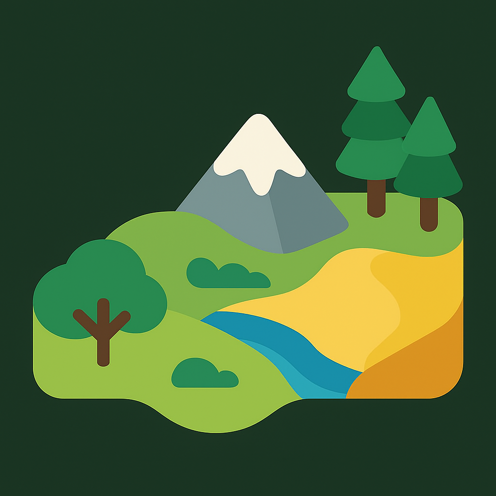

# One-Click Level Generator (OCG)

 

<strong>An Unreal Engine editor plugin that automatically generates terrain, biomes, rivers, and PCG content from a map preset.</strong>

 
 
 <!--  -->
 
 
 

<em>Terrain · Biome Material · Rivers · PCG Generation · Stylized Landscape Material · MapPreset</em>

## Overview

One Click Level Generator is a user-friendly tool that allows you to create levels simply.
You can create a level by setting characteristics for each biome.

## Dependencies

The following plugins are automatically enabled when the OCG plugin is enabled.

- Water Plugin
- Procedural Content Generation Framework (PCG)
- PCG Geometry Script Interop
- PCG Water Interop

## Features

- Create terrain randomly
- Per biome landscape material supports Nanite Tesselation
- Per biome PCG Content Generation
- Random river generation
- Custom editor and MapPreset asset which creates and export level
- Free stylized landscape material
- and more
